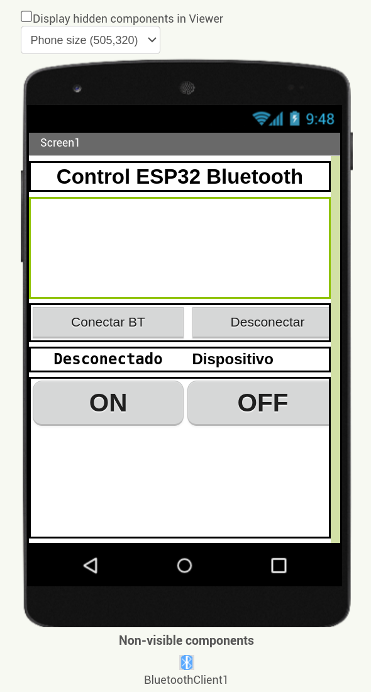
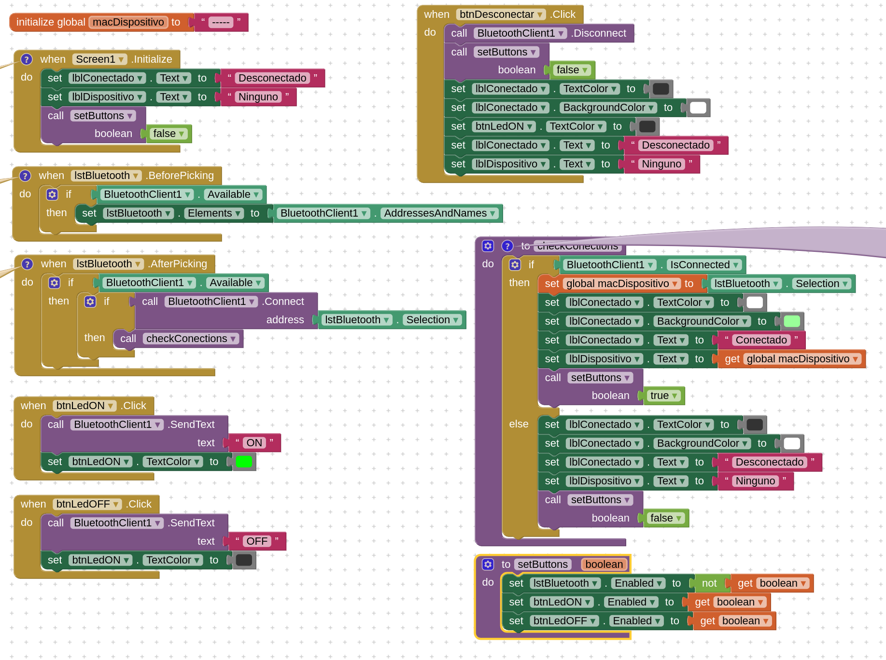
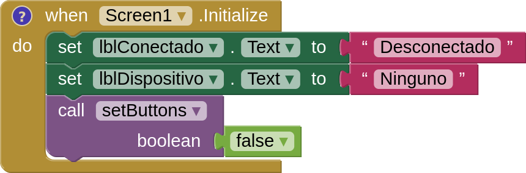
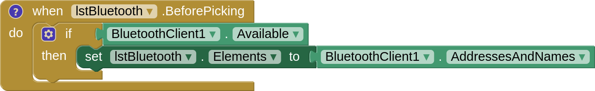
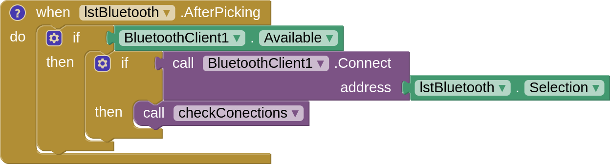
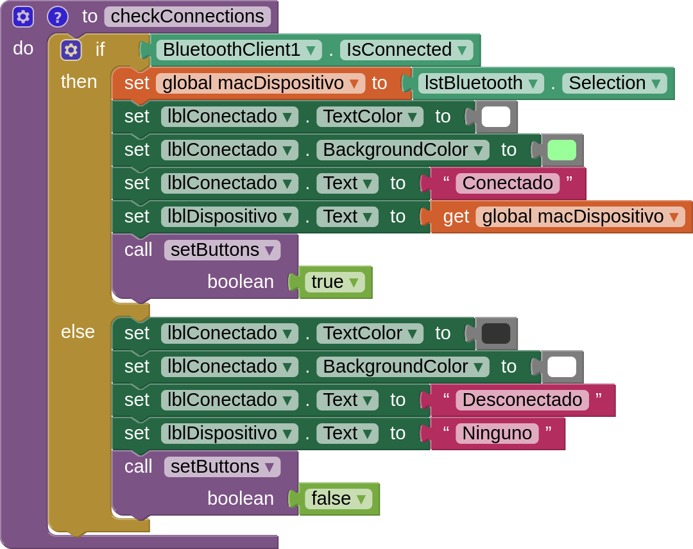
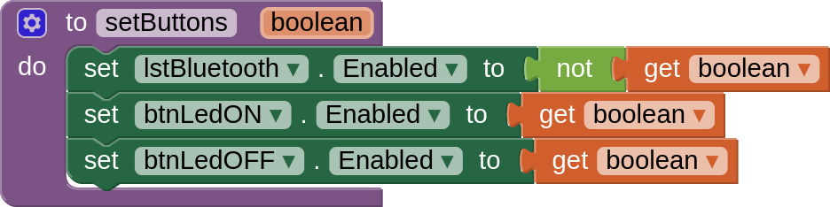
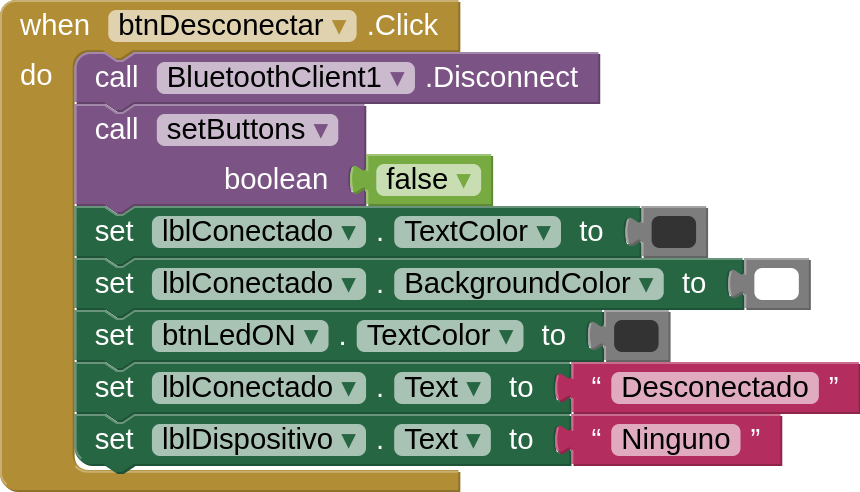
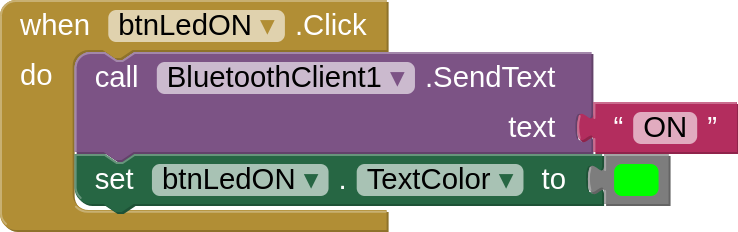
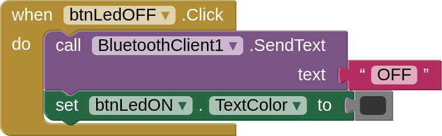

# Taller Bluetooth con APPInventor

## Conexión Bluetooth cliente

En este taller vamos a crear una APP en APPInventor para poder conectarnos mediante Bluetooth a un dispositivo Arduino, ESP32, Micro:Bit etc para poder controlar una serie de elementos conectados a estos.

### Diseño

 En la fase de diseño crearemos primeramente la estructura como ya sabemos. En este caso el Bluetooth en AppInventor lo vamos a usar como cliente para enviar información a otros dispositivos. (Por ejemplo un Arduino/ESP32 al que le enviaremos una secuencia de instrucciones. Encender luz)

 Creamos un título para la aplicación, podemos integrar una imagen como logo (ver foto del diseño) y decorar a nuestro gusto.

 Seguidamente agregaremos el componente Bluetooth client que está en la sección connectivity de la paleta de componentes.

 Dentro de un Layout horizontal agregamos un listpicker que nos servirá para listar las conexiones disponibles y poder seleccionar el dispositivo al que nos vamos a conectar. Tiene la función .click al igual que un botón.

 Añadimos un botón para desconectar el Bluetooth, posteriormente agregamos otro Layout horizontal para agregar un par de etiquetas que nos darán información de si estamos conectados o no y el nombre del dispositivo (su mac).

 Finalmente agregamos un último Layout tipo tabla (por ejemplo) donde podremos agregar los distintos componentes que nos permitirán obtener información o enviar información del dispositivo Bluetooth, solo agregaremos dos botones que servirán para enceder y apagar el led en el dispositivo remoto, en este caso una ESP32Steamakers con la shield Imagina TdR STEAM.

 Una vez hayamos visto el funcionamiento podemos agregar un botón para que toque música, un listpicker para seleccionar la música a tocar, una etiqueta donde veamos la temperatura y la humedad, etc.

Esto sería un diseño inicial de conexión a BT, pasemos a la parte de programación

### Programación

Nota: Para que el programa nos liste nuestro dispositivo BT debemos activar este en el dispositivo móvil y conectarlo inicialmente. Yendo a configuración BT, activar BT y búsqueda de nuevos dispositivos, una vez aparezca el dispositivo a controlar, darle a conectar.

Inicializamos la aplicación con los valores por defecto de cada componente de esta y asegurarnos que todo está en su sitio. También creamos una variable que inicializamos vacía para guardar la información del dispositivo conectado (Guardaremos su dirección mac y el nombre para usar posteriormente).

#### .BeforePicking

Antes de seleccionar el dispositivo al que nos vamos a conectar, debemos guardar el listado de dispositivos BT que tenemos configurado en el móvil/tablet.

Esto nos permite que a la hora de hacer click en el listpicker, nos salga una ventana con todos los dispositivos a los que nos podremos conectar.

Comprobamos si el Bluetooth está disponible y si es así guardamos la lista de nombres de los dispositivos disponibles.

#### .AfterPicking

Ahora programamos el bloque para cuando seleccionemos el dispositivo al que nos queremos conectar. (.AfterPicking)

Cuando hacemos click en la selección del dispositivo, volvemos a comprobar si el Bluetooth sigue disponible y si es así, comprobamos si se ha conectado al dispositivo seleccionado. Si la respuesta es correcta (True), realizaremos la llamada a la función checkConnections que crearemos a continuación.

#### Función checkConnections

Esta función lo que hace es comprobar si estamos correctamente conectados al dispositivo por Bluetooth y si es así configuramos las etiquetas y botones de manera que, visualmente, veamos la conexión. Al mismo tiempo guarda la información (mac) del dispositivo al que nos hemos conectado en la variable macDispositivo creada al inicio.

En el caso de que perdamos la conexión Bluetooth o desconectemos manualmente realizamos la configuración de dichas etiquetas y botones para, de manera visual, comprobemos que efectivamente no hay una conexión.

#### Función setButtons

Tanto en el bloque de inicializar la aplicación (screen.Initialize) como en la función checkConnections y el bloque para desconectar del Bluetooth tenemos una llamada a otra función llamada setButtons, esta función lo que hace es activar y desactivar ciertos botones de la aplicación en función de si estamos o no conectados a un dispositivo por Bluetooth. Se le pasa un booleano (true o false) para llevarlo a cabo.

Hasta aquí ya tenemos configurada la parte de conexión al bluetooth, ahora vamos a programar el botón para poder desconectarnos de este y dejar bien cerrada la apliación.

#### Botón desconectar

Cuando hagamos click en el botón desconectar lo que hará es llamar al método .Disconnect del componente Bluetooth y cambiar las propiedades del resto de componentes de la aplicación al modo desconectado.

Ya tenemos todo lo relacionado con el Bluetooth, llega el momento de programar el funcionamiento de los botones de control del dispositivo Arduino, ESP32 STEAMakers, etc...

#### Programación de los botones Led ON y Led OFF

Esta programación es sencilla cuando hagamos click en cualquiera de los dos botones (btnLedON, btnLedOFF) enviaremos un texto por Bluetooth con la orden concreta para esta función en nuestra placa. También podemos hacer algún cambio en los botones para saber que orden hemos enviado última, como por ejemplo cambiar el color del texto del botón LedON o incluso podemos agregar un par de imágenes que representen un led encendido y otro apagado.

__Programación botón LedON.__

__Programación botón LedOFF.__

________

Notas finales:

Seguiré añadiendo más información y contenido a este taller para poder ampliar el funcionamiento de la aplicación de control para placas tipo Arduino, ESP32 STEAMakers, ESP32,Micro:Bit, etc. (como por ejemplo que nos muestre temperatura, cantidad de luz, humedad, etc, según los sensores y actuadores que tengamos conectados a la placa.)

En la carpeta __src__ está el código fuente del taller y otros ejemplos de aplicaciones con Bluetooth.

En la carpeta __build__ está la apk ya compilada para su instalación de dispositivos Android.